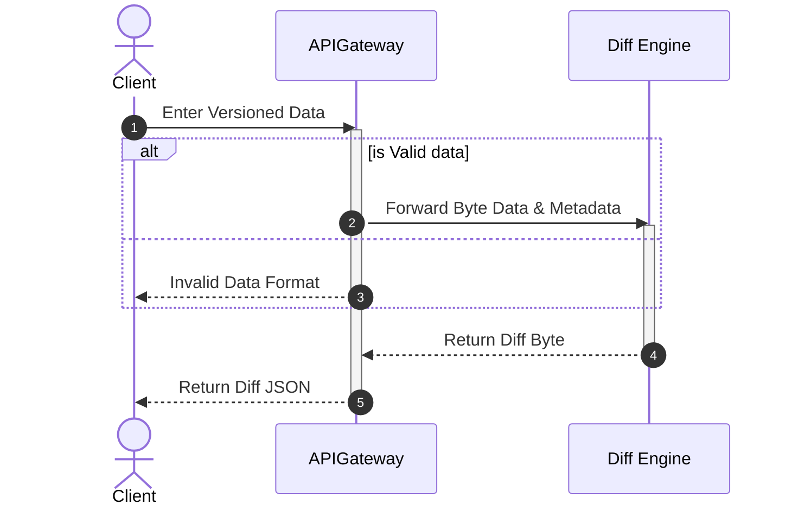

# Diagrams

## Sequence Diagrams

>Version: 1.0.0

- The MVP version doesn't include any message queue application like Kafka.
- It is assumed that the diff engine will be taking a long time to process the data.
- Hence, the API gateway will be waiting for the diff engine to return the result.
- Resulting in longer response time.

